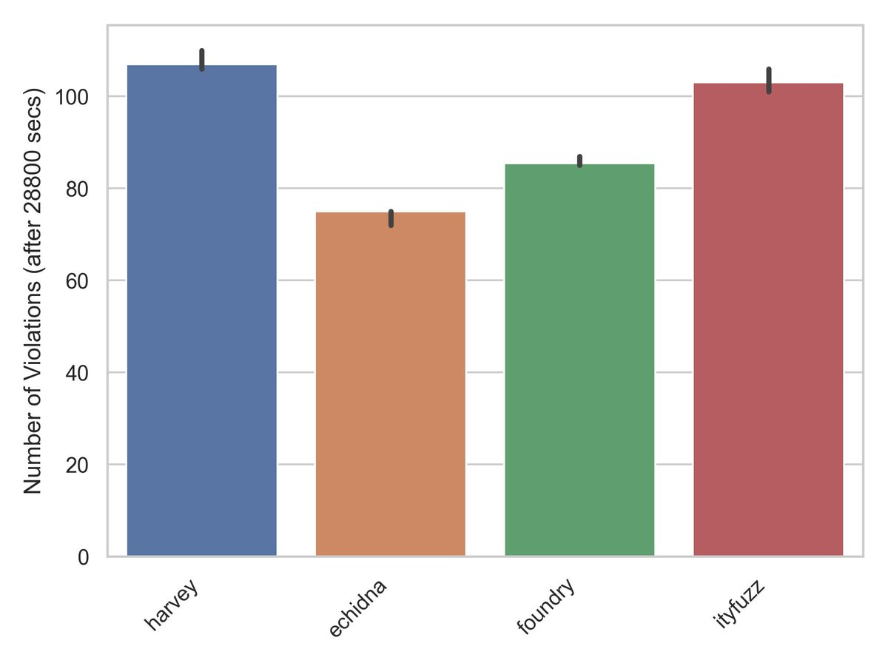

---
layout:
  title:
    visible: true
  description:
    visible: false
  tableOfContents:
    visible: true
  outline:
    visible: true
  pagination:
    visible: true
---

# Introduction

ItyFuzz is the current state-of-the-art fuzz testing tool for smart contracts. To start using ItyFuzz, please check [installation-and-building.md](installation-and-building.md "mention") and [quickstart.md](quickstart.md "mention").

ItyFuzz requires **no manual effort**. You don't need to write invariants or manually specify the input generation strategy. Users supply contract addresses or bytecode, and ItyFuzz autonomously generates the exploit when vulnerabilities are found. It can be easily integrated into CI/CD pipelines. It is also highly configurable and can test different aspects of smart contracts.

Technically, it leverages formal verification (concolic execution) assisted fuzzing algorithms guided by dataflow patterns and comparisons. ItyFuzz can handle DeFi with complex states and interactions and can find over 100 bugs in real-world smart contracts.

### Statistics and Comparisons

**ItyFuzz in Real-world**

Backtesting on 200 exploited projects, ItyFuzz can generate 109 exploits without manual effort or prior knowledge. More information can be found here.

**ItyFuzz vs (Harvey / Echidna / Foundry)**

On [Daedaluzz Dataset](https://github.com/Consensys/daedaluzz), ItyFuzz can find a similar amount of bugs as Consensys Diligence's Harvey tool and **20-40% more bugs** compared to Echidna and Foundry _without formal verification enabled_. In the meantime, ItyFuzz is also faster to uncover bugs at first.

<figure><figcaption>
ItyFuzz, Foundry, Echidna, and Harvey on Bug Finding Capability
</figcaption></figure>

More figures can be found here: [https://twitter.com/vwuestholz/status/1654026298476441600](https://twitter.com/vwuestholz/status/1654026298476441600)

**ItyFuzz vs SMARTIAN**

Please refer to our research paper: https://arxiv.org/abs/2306.17135

### Researches and Publications

Core Algorithm: [https://arxiv.org/abs/2306.17135](https://arxiv.org/abs/2306.17135)

LLM + Fuzzing: [https://scf.so/llm4fuzz.pdf](https://scf.so/llm4fuzz.pdf)

Formal Verification (Concolic Testing): [https://mir.cs.illinois.edu/marinov/publications/SenETAL05CUTE.pdf](https://mir.cs.illinois.edu/marinov/publications/SenETAL05CUTE.pdf)
